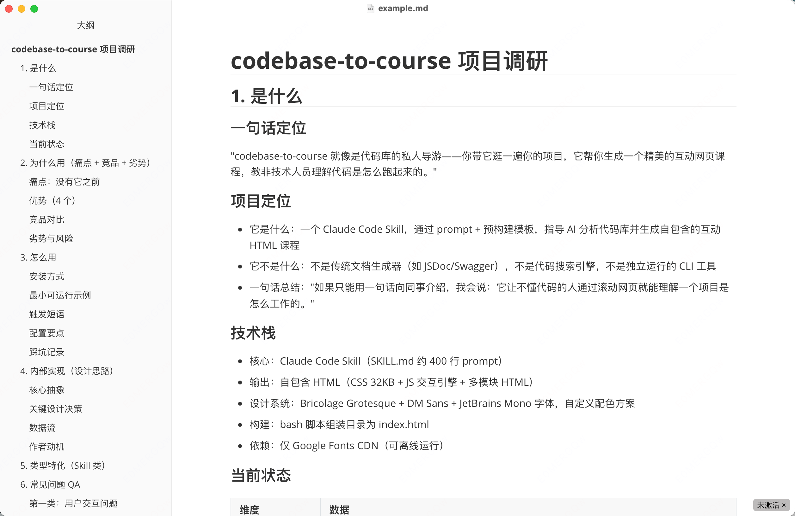

# GitHub Project Research Skill

[中文版本](./README_zh.md)

A Claude Code Skill for structured, multi-source deep research on GitHub projects. This isn't a simple README summary—it conducts research like a serious technical selection engineer, collecting data from multiple sources, autonomously generating and answering 8-10 real-world questions, and ultimately producing a research report with conclusions, evidence, and transparent thinking processes.

## Core Features

Given a GitHub project (URL or `owner/repo`), it will:

1. **Multi-source Data Collection** — GitHub, Zhihu/Xiaohongshu, Hacker News, StackOverflow, npm/PyPI, Reddit
2. **Autonomous Question Generation** — From different perspectives (tech lead, production developer, skeptic, newcomer), generating 8-10 real questions that people actually ask
3. **Show Thinking Process** — Report includes complete analysis chain for 10 core questions: question → what was done → conclusion → follow-up
4. **Generate Structured Report** — 8 chapters, each ending with Socratic questioning that challenges the chapter's conclusions

## Demo



## Design Philosophy

### Question-Driven

Research is not about collecting information—it's about answering questions.

This skill's workflow is structured around 10 core questions—not first collecting data then figuring out how to write the report, but first posing questions, then collecting data with those questions in mind. Each question corresponds to a specific research action:

- "What is it?" → Read README, think of an analogy
- "How did people cope without it?" → Search issues for `why`, `alternative`
- "Where does it fall short compared to competitors?" → Search for `wontfix`, `by design`, `limitation`
- "Why did the author build this?" → Read earliest issues to find motivation

**Data serves questions, not questions bend to data.** First comes the question, then we know where to find answers.

### Socratic Questioning

No conclusion is an endpoint.

Each chapter ends with a "follow-up question"—Socratic questions that challenge the conclusion just reached:

- After "what is it": "If I could only explain it to a non-technical friend in one sentence, what would I say?"
- After "why use it": "Is this pain point really bad enough to need a new tool?"
- After "how to use it": "Can I show a colleague results within 5 minutes?"
- After "competitor comparison": "Where is the fork point between it and the closest competitor?"
- After "core advantages": "Under what circumstances would this advantage become a disadvantage?"

**The purpose of follow-up questions is not to否定 conclusions, but to make them stronger.** Conclusions that withstand questioning are worth trusting.

## Installation

Copy this directory to `~/.claude/skills/`. Claude Code will discover it automatically.

```bash
git clone https://github.com/weiambt/github-project-research
cp -r github-project-research ~/.claude/skills/
```

On first use, it will ask for the report output directory. Default is `~/research-docs/<project-name>.md`.

## How to Invoke

```
/github-project-research research github.com/owner/repo

why XXX

/github-project-research generate research report
```

## Report Structure

| Chapter | Content |
|---------|---------|
| 1. What is it | One-sentence analogy + project positioning + tech stack + current status |
| 2. Why use it | Pain points + advantages (with evidence) + competitor comparison (including weaknesses) + risks |
| 3. How to use it | Installation + minimal working example + common scenarios + pitfalls |
| 4. Internal implementation | Core abstractions + key design decisions (with tradeoffs) + author motivation |
| 5. Type-specific | Additional dimensions based on project type (framework/tool/platform/learning material/Skill) |
| 6. Common Questions QA | 8-10 autonomously generated real-world questions (not copied from GitHub issues) |
| 7. Analysis Process | Transparency into the thinking process for 10 core questions |
| 8. Summary | Conditional recommendation: recommendation level + conditions for recommendation + conditions for non-recommendation |

## Data Sources

| Source | Tool | Description |
|--------|------|-------------|
| GitHub | firecrawl scrape | Repo pages, README, releases, issues |
| Hacker News | firecrawl search | Technical depth discussions, architecture reviews |
| StackOverflow | firecrawl search | Common questions, solutions |
| npm / PyPI | firecrawl scrape | Download counts, version history |
| Zhihu / Xiaohongshu / Juejin | firecrawl search | Real user feedback, reviews (SPA sites) |
| Reddit | firecrawl search | English community discussions |
| Competitor research | firecrawl search | alternatives, vs |

## Interactive Workflow

Research isn't one-time. After the report is presented, you can continue asking:

- "How does it compare to X?" → Deep competitor comparison
- "How is its Y implemented?" → Source code architecture explanation
- "Can it be used in scenario Z?" → Evaluate suitability for specific scenarios
- "What are the pitfalls?" → Search issues and known problems

Multiple projects can be researched in the same session, displayed side-by-side for comparison.

## File Structure

```
github-project-research/
├── SKILL.md                          # Main file: workflow definition
├── references/
│   └── report-template.md            # Report template (loaded when generating reports)
├── agents/
│   └── openai.yaml                   # UI metadata
└── README.md                        # English version
└── README_zh.md                     # Chinese version
```

## Design Principles

- **Show thinking process, not just conclusions** — Seeing "how did we arrive at this" is more valuable to users than "what is it"
- **Disadvantages are what make research real** — Only comparing advantages is marketing; honestly listing disadvantages helps people make decisions
- **Autonomous QA generation** — Don't copy questions from GitHub issues; instead, pose questions from the user's perspective that people would actually ask in real life
- **Conditional recommendations** — Don't say "this project is good"; instead say "choose this if you need XX, choose something else if you need YY"
